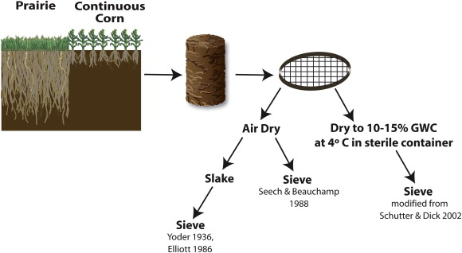
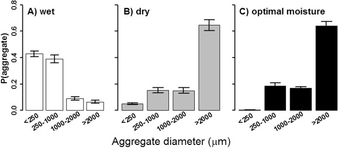
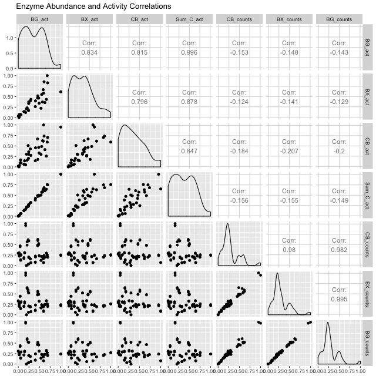

COBS
========================================================
author: Jared, Jordy, Phil and Sarah 
date: 2016_12_13        
autosize: true
css: style1.css

======================================================= 
class: Jordy
 

======================================================= 
class: Jordy


======================================================= 
class: Jordy


======================================================= 
class: Jordy



======================================================= 
class: Jordy


======================================================= 
class: Jordy


  1. (BG) beta-glucosidase [EC:3.2.1.21] is an Endocellulase
  2. (BX) beta-D-xylosidase 4 [EC:3.2.1.37] is an Exocellulase
  3. (CB) 1,4-beta-cellobiosidase [EC:3.2.1.91] is a Cellobiase

Python script
=======================================================
class: Jordy

```python
import sys
from Bio import Entrez, SeqIO

Entrez.email = 'jflater@iastate.edu'

# First, find entries that contain the E.C. number
ec_num = sys.argv[1].strip()
#print ec_num
#print 'E.C. '+ ec_num
esearch_handle = Entrez.esearch(db='nucleotide', term='EC '+ec_num)
# When term='E.C. we get zero results, however, if term=EC it works
entries = Entrez.read(esearch_handle)
esearch_handle.close()

# Second, fetch these entries
efetch_handle = Entrez.efetch(db='nucleotide', id=entries['IdList'], rettype='gb', retmode='xml') 
records = Entrez.parse(efetch_handle)

# Now, we go through the records and look for a feature with name 'EC_number'
for record in records:
      for feature in record['GBSeq_feature-table']:
          for subfeature in feature['GBFeature_quals']:
              if (subfeature['GBQualifier_name'] == 'EC_number'   and
                subfeature['GBQualifier_value'] == ec_num):
```

Python script
=======================================================
class: Jordy

```python
                    # If we found it, we extract the seq's start and end
                    accession = record['GBSeq_primary-accession']
                    interval = feature['GBFeature_intervals'][0]
                    interval_start = interval['GBInterval_from']
                    interval_end = interval['GBInterval_to']
                    location = feature['GBFeature_location']
                    if location.startswith('complement'):
                        strand = 2
                    else:
                        strand = 1

                    # Now we fetch the nucleotide sequence
                    handle = Entrez.efetch(db="nucleotide", id=accession,
                                           rettype="fasta", strand=strand,
                                           seq_start = interval_start,
                                           seq_stop = interval_end)
                    seq = SeqIO.read(handle, "fasta")

                    print('>GenBank Accession:{}'.format(accession))
                    print(seq.seq)
efetch_handle.close()
```


Basic Local Alignment Search Tool (finds regions of similarity)
======================================================= 
class: Jordy

1. Retrieve meta genomes from MG-RAST
2. Retrieve amino acid sequences for enzymes (BLASTP) of interest
3. Use amino acid sequence to query NCBI and get nucleotide sequence
4. 3 nucleotide databases generated(one for each enzyme)
5. BLASTN each nucleotide db against meta genomes from soil
6. Generate count table for each enzyme (count of nuc sequences associated with our enzymes)

Summary Counts
======================================================= 
class: Jordy

```bash
head data/summary_counts/summary-count-21.tsv
```

```
	A10_GATCAG_L006_R1_001	A10_GATCAG_L006_R2_001	A11_TAGCTT_L006_R1_001	A11_TAGCTT_L006_R2_001	A12_GGCTAC_L006_R1_001	A12_GGCTAC_L006_R2_001	A1_CGATGT_L007_R1_001	A1_CGATGT_L007_R2_001	A2_TGACCA_L007_R1_001	A2_TGACCA_L007_R2_001	A3_ACAGTG_L007_R1_001	A3_ACAGTG_L007_R2_001	A4_GCCAAT_L007_R1_001	A4_GCCAAT_L007_R2_001	A5_CAGATC_L007_R1_001	A5_CAGATC_L007_R2_001	A6_CTTGTA_L007_R1_001	A6_CTTGTA_L007_R2_001	A7_ATCACG_L007_R1_001	A7_ATCACG_L007_R2_001	A8_TTAGGC_L007_R1_001	A8_TTAGGC_L007_R2_001	A9_ACTTGA_L006_R1_001	A9_ACTTGA_L006_R2_001	B10_GAGTGG_L007_R1_001	B10_GAGTGG_L007_R2_001	B11_ACTGAT_L007_R1_001	B11_ACTGAT_L007_R2_001	B12_ATTCCT_L007_R1_001	B12_ATTCCT_L007_R2_001	B1_AGTCAA_L006_R1_001	B1_AGTCAA_L006_R2_001	B2_AGTTCC_L006_R1_001	B2_AGTTCC_L006_R2_001	B3_ATGTCA_L006_R1_001	B3_ATGTCA_L006_R2_001	B4_CCGTCC_L006_R1_001	B4_CCGTCC_L006_R2_001	B5_GTCCGC_L007_R1_001	B5_GTCCGC_L007_R2_001	B6_GTGAAA_L007_R1_001	B6_GTGAAA_L007_R2_001	B7_GTGGCC_L007_R1_001	B7_GTGGCC_L007_R2_001	B8_GTTTCG_L007_R1_001	B8_GTTTCG_L007_R2_001	B9_CGTACG_L007_R1_001	B9_CGTACG_L007_R2_001	H10_CCGTCC_L008_R1_001	H10_CCGTCC_L008_R2_001	H11_GTCCGC_L008_R1_001	H11_GTCCGC_L008_R2_001	H12_GTGAAA_L008_R1_001	H12_GTGAAA_L008_R2_001	H13_ATGTCA_L007_R1_001	H13_ATGTCA_L007_R2_001	H14_ACTTGA_L007_R1_001	H14_ACTTGA_L007_R2_001	H1_CGATGT_L006_R1_001	H1_CGATGT_L006_R2_001	H3_ACAGTG_L006_R1_001	H3_ACAGTG_L006_R2_001	H4_GCCAAT_L006_R1_001	H4_GCCAAT_L006_R2_001	H5_CAGATC_L006_R1_001	H5_CAGATC_L006_R2_001	H6_CTTGTA_L007_R1_001	H6_CTTGTA_L007_R2_001	H8_AGTTCC_L007_R1_001	H8_AGTTCC_L007_R2_001	H9_ATCACG_L008_R1_001	H9_ATCACG_L008_R2_001	Hofmocke17_AGTTCC_L005_R1_001	Hofmocke17_AGTTCC_L005_R2_001	Hofmockel15_GATCAG_L003_R1_001	Hofmockel15_GATCAG_L003_R2_001	Hofmockel16_TAGCTT_L003_R1_001	Hofmockel16_TAGCTT_L003_R2_001	Hofmockel18_GTGGCC_L005_R1_001	Hofmockel18_GTGGCC_L005_R2_001	Hofmockel19_GTTTCG_L005_R1_001	Hofmockel19_GTTTCG_L005_R2_001	Hofmockel20_CGTACG_L005_R1_001	Hofmockel20_CGTACG_L005_R2_001	Hofmockel2_TGACCA_L003_R1_001	Hofmockel2_TGACCA_L003_R2_001	Hofmockel30_GAGTGG_L006_R1_001	Hofmockel30_GAGTGG_L006_R2_001	Hofmockel34_ACTGAT_L006_R1_001	Hofmockel34_ACTGAT_L006_R2_001	Hofmockel35_ATTCCT_L006_R1_001	Hofmockel35_ATTCCT_L006_R2_001	Hofmockel39_CGATGT_L006_R1_001	Hofmockel39_CGATGT_L006_R2_001	Hofmockel41_TGACCA_L001_R1_001	Hofmockel41_TGACCA_L001_R2_001	Hofmockel43_ACAGTG_L001_R1_001	Hofmockel43_ACAGTG_L001_R2_001	Hofmockel57_GCCAAT_L001_R1_001	Hofmockel57_GCCAAT_L001_R2_001	Hofmockel59_CAGATC_L001_R1_001	Hofmockel59_CAGATC_L001_R2_001	Hofmockel7_AGTCAA_L003_R1_001	Hofmockel7_AGTCAA_L003_R2_001
IF31_RS0116175	0	1	0	0	0	0	0	0	0	0	1	0	0	1	1	0	1	0	0	0	0	0	0	0	0	0	0	0	1	0	0	1	2	2	0	0	1	0	0	0	0	0	0	0	0	0	0	0	0	0	0	0	0	0	0	0	0	0	0	0	0	0	0	0	0	0	0	0	0	0	0	0	0	0	0	0	1	0	0	0	0	0	0	0	0	0	0	0	0	0	0	0	1	0	0	0	0	0	2	0	1	1	0	0
K314_RS0111100	0	0	2	0	1	1	0	0	0	0	0	0	0	0	0	0	0	0	0	0	0	0	0	0	0	0	0	0	0	0	0	0	0	1	0	0	0	0	0	0	0	0	0	0	0	0	0	0	0	0	0	0	0	0	0	0	3	1	1	0	0	0	0	0	0	0	0	0	0	0	0	0	0	0	0	0	0	0	0	0	0	0	0	0	0	0	0	0	0	0	0	0	0	0	0	0	0	0	0	0	0	0	0	0
PSNIH1_RS09265	0	0	0	0	0	0	0	0	0	0	0	0	0	0	0	0	0	0	0	0	0	0	0	0	0	0	0	0	0	0	0	0	0	0	0	0	0	0	0	0	1	0	0	0	0	0	0	0	0	0	0	0	0	0	0	0	1	0	0	0	0	0	0	0	0	0	0	0	0	0	0	0	0	0	0	0	0	0	0	0	0	0	0	0	0	0	0	0	0	0	0	0	0	0	0	0	0	0	0	0	0	0	0	0
B072_RS0125095	0	0	0	0	1	0	0	0	0	0	0	0	0	0	0	0	0	0	0	0	0	0	0	0	0	0	0	0	0	0	0	0	0	0	0	0	1	0	0	0	0	0	0	0	0	0	0	0	0	0	0	0	0	1	0	0	0	0	0	0	0	0	0	1	0	0	0	0	0	0	0	0	0	0	0	0	0	0	0	0	0	0	0	0	0	0	0	0	0	0	0	0	0	0	0	0	0	0	0	0	0	0	0	0
G618_RS0100660	0	0	0	0	0	0	0	0	0	0	0	0	0	0	0	0	1	1	0	0	0	0	0	0	0	0	0	0	0	0	0	0	0	0	0	0	0	0	0	0	0	0	0	0	0	0	0	0	0	0	0	0	0	0	0	0	0	0	0	0	0	0	0	0	0	0	0	0	0	0	0	0	0	0	0	0	0	0	0	0	0	0	0	0	0	0	0	0	0	0	0	0	0	0	0	0	0	0	0	0	0	0	0	0
TU94_RS12250	2	0	3	1	3	2	2	2	0	1	0	1	1	2	0	0	1	0	1	0	1	0	0	0	1	0	1	0	1	0	0	1	2	0	0	0	0	1	0	1	0	3	1	3	1	0	1	0	0	0	1	2	3	2	0	0	0	5	1	1	1	0	5	3	0	0	0	0	0	2	1	3	0	0	0	0	1	2	0	0	0	0	0	1	1	1	0	0	0	0	0	0	0	0	0	1	1	2	3	0	1	0	1	0
AR334_RS09815	0	0	0	0	0	0	0	0	0	0	0	0	0	0	0	0	0	0	0	0	0	0	0	0	0	0	0	0	0	0	0	0	0	0	0	0	0	0	0	0	0	0	1	1	0	0	0	0	0	0	0	0	0	0	0	0	0	0	0	0	0	0	0	0	0	0	0	0	0	0	0	0	0	0	0	0	0	0	0	0	0	0	0	0	0	0	0	0	0	0	0	0	0	0	0	0	0	0	0	0	0	0	0	0
JE47_RS0108850	0	0	0	0	0	0	0	0	0	0	0	0	0	0	0	0	0	0	0	0	0	0	0	0	0	0	0	0	0	0	0	0	0	0	0	0	0	0	0	0	0	0	0	0	0	0	0	0	0	0	0	0	0	1	0	0	2	1	0	0	0	0	0	0	0	0	0	0	0	0	0	0	0	0	0	0	0	0	0	0	0	0	0	0	0	0	0	0	0	0	0	0	0	0	0	0	0	0	0	0	1	0	0	0
THIT_RS01615	0	0	0	0	0	0	0	0	0	0	0	0	0	0	0	0	0	0	0	0	0	0	0	0	0	0	0	0	0	0	0	0	0	0	0	0	0	0	0	0	0	0	0	0	0	0	0	0	0	0	0	0	0	0	0	0	0	0	0	0	0	0	1	0	0	0	0	0	0	0	0	0	0	0	0	0	0	0	0	0	0	0	0	0	0	0	0	0	0	0	0	0	0	0	0	0	0	0	0	0	0	0	0	0
```

Sarah
======================================================= 
class: Jordy

Data Dictionary Format
======================================================= 
class: Jordy
Sections for: 
- column name in spreadsheet
- full column name 
  - ex. veg_class = Vegetation Class
- descriptions of process
  - ex. Gas measurements in micro moles per square meter
  
Packages Used for Data Dictionary
======================================================= 
class: Jordy

- Kable
  - Creates rectangular table
  

```r
kable(x, format, digits = getOption("digits"), row.names = NA, col.names = NA, align, caption = NULL, format.args = list(), escape = TRUE, ...)

knitr::kable(head(data_dictionary))
```

Special Changes for Output
======================================================= 
class: Jordy

```
[1] "$\\beta$-N-acetylglucosaminidase Activity"
```
"$\\beta$-N-acetylglucosaminidase Activity"
  - Code to produce Beta symbol
  - Important for correct enzyme assignment
  
Data Dictionary Output
======================================================= 
class: Jordy

|name         |column       |description                    |
|:------------|:------------|:------------------------------|
|plot         |Plot         |Plot sample was taken from     |
|treatment    |Treatment    |Treatment number plot received |
|sample_month |Sample Month |Month the sample was taken     |
|sample_year  |Sample Year  |Year the sample was taken      |
|crop         |Crop         |Cropping system                |
|sample_block |Sample Block |Experimental block             |

Jordy
========================================================


Tidying COBS Data
======================================================= 
class: Jordy

```r
cobs_data<- read.csv("data/KBase_MGRast_Metadata_9May2013_EMB.csv", stringsAsFactors = FALSE)
library(tidyverse)
head(cobs_data, 3)
```

```
                                                  sample_name
1 Unique name or id of the sample the library is derived from
2                                            CC12-LM-July2012
3                                         CC12-Micro-July2012
  month_sampled year_sampled     crop_system       sample_block
1 month sampled year sampled cropping system experimental block
2          July         2012            corn                  1
3          July         2012            corn                  1
            agg_frac                       mgrast_id
1 aggregate fraction MG-RAST Enviromental Package ID
2                 LM                        mge94361
3              micro                        mge94364
                                                                                                                                                                                                                                                                              agrochem_addition
1                                                                                                                                                                                                                   addition of fertilizers, pesticides, etc. - amount and time of applications
2 72 lb N/acre liquid urea ammonia nitrate (32% solution) applied at planting (2012-5-11); Spray 28 oz/ac  Roundup PowerMax (49% glyphosate) + 19 oz/ac Outlook (2012-5-12);  100 lb N/acre liquid urea ammonia nitrate (32% solution) + 28 oz/ac Roundup PowerMax (49% glyphosate) (2012-6-12)
3 72 lb N/acre liquid urea ammonia nitrate (32% solution) applied at planting (2012-5-11); Spray 28 oz/ac  Roundup PowerMax (49% glyphosate) + 19 oz/ac Outlook (2012-5-12);  100 lb N/acre liquid urea ammonia nitrate (32% solution) + 28 oz/ac Roundup PowerMax (49% glyphosate) (2012-6-12)
                                                  crop_rotation
1 whether or not crop is rotated, and if yes, rotation schedule
2                                                            no
3                                                            no
                  cur_land_use
1 present state of sample site
2         row crop agriculture
3         row crop agriculture
                                                                                    cur_vegetation
1 vegetation classification from one or more standard classification systems, or agricultural crop
2                                                                                                7
3                                                                                                7
                                    cur_vegetation_meth
1 reference or method used in vegetation classification
2                                                 USNVC
3                                                 USNVC
                                                          drainage_class
1 drainage classification from a standard system such as the USDA system
2                                                         poorly drained
3                                                         poorly drained
                                                         extreme_event
1 unusual physical events that may have affected microbial populations
2                                                    2012 drought year
3                                                    2012 drought year
                                                                     fao_class
1 soil classification from the FAO World Reference Database for Soil Resources
2                                                                     Phaeozem
3                                                                     Phaeozem
                                         fire
1 historical and/or physical evidence of fire
2                                          no
3                                          no
                                                                                                                                                            horizon
1 specific layer in the land area which measures parallel to the soil surface and possesses physical characteristics which differ from the layers above and beneath
2                                                                                                                                                                Ap
3                                                                                                                                                                Ap
                                         horizon_meth
1 reference or method used in determining the horizon
2                                    USDA Soil Survey
3                                    USDA Soil Survey
                                                       link_class_info
1 link to digitized soil maps or other soil classification information
2            http://websoilsurvey.nrcs.usda.gov/app/WebSoilSurvey.aspx
3            http://websoilsurvey.nrcs.usda.gov/app/WebSoilSurvey.aspx
                                                    local_class
1 soil classification based on local soil classification system
2                                                    Endoaquoll
3                                                    Endoaquoll
                                                       local_class_meth
1 reference or method used in determining the local soil classification
2                                                             USDA NRCS
3                                                             USDA NRCS
                      mgrast_id.1
1 MG-RAST Enviromental Package ID
2                                
3                                
                                                                                                                                                                                                                                   microbial_biomass
1 the part of the organic matter in the soil that constitutes living microorganisms smaller than 5-10 _µm. IF you keep this, you would need to have correction factors used for conversion to the final units, which should be mg C (or N)/kg soil).
2                                                                                                                                                                                                                                                   
3                                                                                                                                                                                                                                                   
                                     microbial_biomass_meth
1 reference or method used in determining microbial biomass
2                                                          
3                                                          
                                                                       misc_param
1 any other measurement performed or parameter collected, that is not listed here
2                                                                                
3                                                                                
              ph                                    ph_meth
1 pH measurement reference or method used in determining pH
2           6.77                     pH meter, 1:2 soil:H2O
3           6.77                     pH meter, 1:2 soil:H2O
                               pool_dna_extracts
1 were multiple DNA extractions mixed? how many?
2                                             no
3                                             no
            previous_land_use
1 previous land use and dates
2            row crop, ?-2007
3            row crop, ?-2007
                                               previous_land_use_meth
1 reference or method used in determining previous land use and dates
2                                                                    
3                                                                    
                                                                                                            profile_position
1 cross-sectional position in the hillslope where sample was collected.sample area position in relation to surrounding areas
2                                                                                                                           
3                                                                                                                           
                                     salinity_meth
1 reference or method used in determining salinity
2                                                 
3                                                 
           samp_weight_dna_ext
1 weight (g) of soil processed
2                             
3                             
                                                                             sieving
1 collection design of pooled samples and/or sieve size and amount of sample sieved 
2                                                                             8-2 mm
3                                                                             2-1 mm
                                                                                                                                                                                                                                                                             slope_aspect
1 the direction a slope faces. While looking down a slope use a compass to record the direction you are facing (direction or degrees); e.g., NW or 315_\u008d.  This measure provides an indication of sun and wind exposure that will influence soil temperature and evapotranspiration.
2                                                                                                                                                                                                                                                                                        
3                                                                                                                                                                                                                                                                                        
                                                                                                                                                                                                                         slope_gradient
1 commonly called ___slope.__\u009d  The angle between ground surface and a horizontal line (in percent).  This is the direction that overland water would flow.  This measure is usually taken with a hand level meter or clinometer. 
2                                                                                                                                                                                                                                  0-3%
3                                                                                                                                                                                                                                  0-3%
                                             soil_type
1 soil series name or other lower-level classification
2                              Webster silty clay loam
3                              Webster silty clay loam
                                                                                soil_type_meth
1 reference or method used in determining soil series name or other lower-level classification
2                                                                                    USDA NRCS
3                                                                                    USDA NRCS
                                                                      store_cond
1 explain how and for how long the soil sample was stored before DNA extraction.
2                                                            (-80C) for 3 months
3                                                            (-80C) for 3 months
                                                                                                                                                                                                                                                texture
1 the relative proportion of different grain sizes of mineral particles in a soil, as described using a standard system; express as % sand (50 um to 2 mm), silt (2 um to 50 um), and clay (<2 um) with textural name (e.g., silty clay loam) optional.
2                                                                                                                                                                                                                                      32.2, 37.4, 30.4
3                                                                                                                                                                                                                                      32.2, 37.4, 30.5
                                          texture_meth
1 reference or method used in determining soil texture
2                                              pipette
3                                              pipette
                          tillage
1 note method(s) used for tilling
2                              no
3                              no
                                                    tot_n
1 total nitrogen content of the soil Units of g N/kg soil
2                                             0.103445426
3                                              0.09566322
                                           tot_n_meth
1 reference or method used in determining the total N
2                                      dry combustion
3                                      dry combustion
                                           tot_org_c_meth
1 reference or method used in determining total organic C
2                                                        
3                                                        
                                                                                                                       tot_org_carb
1 Definition for soil: total organic C content of the soil units of g C/kg soil. Definition otherwise: total organic carbon content
2                                                                                                                                  
3                                                                                                                                  
              water_content_soil
1 water content (g/g or cm3/cm3)
2                    0.131073446
3                    0.094882729
                                            water_content_soil_meth
1 reference or method used in determining the water content of soil
2                                                       gravimetric
3                                                       gravimetric
  misc_param.1
1 total C mg/g
2  5.237405777
3  4.352434158
                                                                     misc_param_1
1 any other measurement performed or parameter collected, that is not listed here
2                                                               env_package: soil
3                                                               env_package: soil
             misc_param_10 misc_param_11          misc_param_12
1 MBN ugN g-1 dry soil CFE    MBN gN m-2  ExtC ugC g-1 dry soil
2              15.29833436   1.714440509            39.63016527
3              15.29833436   1.714440509            39.63016527
         misc_param_13          misc_param_14        misc_param_15
1 Extractable C gC m-2  ExtC ugN g-1 dry soil Extractable N gC m-2
2            4.4412391            13.37876886          1.499320303
3            4.4412391            13.37876886          1.499320303
        misc_param_16                        misc_param_17
1 bulk density g cm-3 Bray Extractable P, mg kg-1 dry soil
2         1.120671355                                   42
3         1.120671355                                   42
       misc_param_18                         misc_param_2
1 AMF colonization % AP Activity (nmol/h/g dry aggregate)
2         0.96460177                          3817.935026
3         0.96460177                          2707.967989
                          misc_param_3
1 BG Activity (nmol/h/g dry aggregate)
2                          347.4823871
3                          484.6664472
                          misc_param_4
1 BX Activity (nmol/h/g dry aggregate)
2                          68.18962193
3                          77.18980431
                          misc_param_5
1 CB Activity (nmol/h/g dry aggregate)
2                          31.71779153
3                          44.92794971
                           misc_param_6
1 NAG Activity (nmol/h/g dry aggregate)
2                           60.99716163
3                            48.0673614
                                          misc_param_7
1 sum C Activity (nmol/h/g dry aggregate) BG + BX + CB
2                                          447.3898006
3                                          606.7842012
              misc_param_8    misc_param_9   MBC_MBN_meth   ExtC_ExtN_meth
1 MBC ugC g-1 dry soil CFE MBC gC m-2 CFE  MBC_MBN_method ExtC_ExtN_method
2              258.8184796     29.00504562      CFE_K2SO4 K2SO4_extraction
3              258.8184796     29.00504562      CFE_K2SO4 K2SO4_extraction
     AMF_col_meth      misc_para19     root_depth     misc_para20
1  AMF_col_method root_biomassMgHa root_depth(cm) AMF_col_biomass
2 intersect_count           0.2197           0-15          0.2119
3 intersect_count           0.2197           0-15          0.2119
  misc_para21 misc_para22       misc_para23           misc_para24
1     MBC:MBN      MWD_um prop_agg_fraction N2O_gas2011_umol_m2_h
2 16.91808229 3014.572915       0.513651935                0.4021
3 16.91808229 3014.572915       0.053514691                0.4021
            misc_para25           misc_para26           misc_para27
1 CH4_gas2011_umol_m2_h N20_gas2012_umol_m2_h CO2_gas2011_umol_m2_s
2               -0.1892           0.122794592                  4.29
3               -0.1892           0.122794592                  4.29
            misc_para28
1 CO2_gas2012_umol_m2_h
2                     .
3                     .
```

Editing 1
======================================================= 
class: Jordy

```r
colnames(cobs_data)<-c("sample_Id" , "sample_month" , "sample_year" , "crop" , "sample_block" , "agg_frac" , "MGRAST_Id" , "agrochem_addition" , "crop_rot" , "land_use" , "veg_class" , "veg_class_meth" , "drain_class" , "extreme_event" , "FAO_class" , "fire_hist" , "soil_hor" , "soil_hor_meth" , "link_soil_method" , "soil_tax" , "soil_tax_meth" , "MGRAST_Id" , "micro_bm" , "micro_bm_meth" , "misc_param" , "pH" , "pH_meth" , "dna_mix" , "land_use_pre" , "land_use_pre_meth" , "sample_position" , "salinity_meth" , "sample_wt_dna" , "siev_size" , "slope_aspect" , "slope_grad" , "soil_type" , "soil_type_meth" , "store_cond" , "texture" , "texture_meth" , "till" , "total_N" , "total_N_meth" , "total_OC_meth" , "total_OC" , "soil_water" , "soil_water_meth" , "total_C" , "misc_param_1" , "MBN_dry" , "MBN_applied" , "Ext_C_dry" , "Ext_C_applied" , "Ext_C_N_dry" , "Ext_N_applied" , "Bulk_dense" , "Ext_P_dry" , "AMF_col" , "AP_act" , "BG_act" , "BX_act" , "CB_act" , "NAG_act" , "Sum_C_act" , "MBC_dry" , "MBC_applied" , "MBC_MBN_meth" , "Ext_C_Ext_N_meth" , "AMF_col_meth" , "root_bm" , "root_dep" , "AMF_col_bm" , "MBC:MBN" , "MWD" , "agg_frac_prop" , "N2O_2011" , "CH4_2011" , "N2O_2012" , "CO2_2011" , "CO2_2012")
```
- Editing of column names

```r
to_remove <- names(which(table(names(cobs_data)) > 1))
cobs_updated <- cobs_data[-1, !(to_remove == names(cobs_data))]
```
- Deletion of duplicates/first row

Result
======================================================= 
class: Jordy

```r
head(cobs_updated, 3)
```

```
            sample_Id sample_month sample_year crop sample_block agg_frac
2    CC12-LM-July2012         July        2012 corn            1       LM
3 CC12-Micro-July2012         July        2012 corn            1    micro
4    CC12-MM-July2012         July        2012 corn            1       MM
                                                                                                                                                                                                                                                                              agrochem_addition
2 72 lb N/acre liquid urea ammonia nitrate (32% solution) applied at planting (2012-5-11); Spray 28 oz/ac  Roundup PowerMax (49% glyphosate) + 19 oz/ac Outlook (2012-5-12);  100 lb N/acre liquid urea ammonia nitrate (32% solution) + 28 oz/ac Roundup PowerMax (49% glyphosate) (2012-6-12)
3 72 lb N/acre liquid urea ammonia nitrate (32% solution) applied at planting (2012-5-11); Spray 28 oz/ac  Roundup PowerMax (49% glyphosate) + 19 oz/ac Outlook (2012-5-12);  100 lb N/acre liquid urea ammonia nitrate (32% solution) + 28 oz/ac Roundup PowerMax (49% glyphosate) (2012-6-12)
4 72 lb N/acre liquid urea ammonia nitrate (32% solution) applied at planting (2012-5-11); Spray 28 oz/ac  Roundup PowerMax (49% glyphosate) + 19 oz/ac Outlook (2012-5-12);  100 lb N/acre liquid urea ammonia nitrate (32% solution) + 28 oz/ac Roundup PowerMax (49% glyphosate) (2012-6-12)
  crop_rot             land_use veg_class veg_class_meth    drain_class
2       no row crop agriculture         7          USNVC poorly drained
3       no row crop agriculture         7          USNVC poorly drained
4       no row crop agriculture         7          USNVC poorly drained
      extreme_event FAO_class fire_hist soil_hor    soil_hor_meth
2 2012 drought year  Phaeozem        no       Ap USDA Soil Survey
3 2012 drought year  Phaeozem        no       Ap USDA Soil Survey
4 2012 drought year  Phaeozem        no       Ap USDA Soil Survey
                                           link_soil_method   soil_tax
2 http://websoilsurvey.nrcs.usda.gov/app/WebSoilSurvey.aspx Endoaquoll
3 http://websoilsurvey.nrcs.usda.gov/app/WebSoilSurvey.aspx Endoaquoll
4 http://websoilsurvey.nrcs.usda.gov/app/WebSoilSurvey.aspx Endoaquoll
  soil_tax_meth micro_bm micro_bm_meth misc_param   pH
2     USDA NRCS                                   6.77
3     USDA NRCS                                   6.77
4     USDA NRCS                                   6.77
                 pH_meth dna_mix     land_use_pre land_use_pre_meth
2 pH meter, 1:2 soil:H2O      no row crop, ?-2007                  
3 pH meter, 1:2 soil:H2O      no row crop, ?-2007                  
4 pH meter, 1:2 soil:H2O      no row crop, ?-2007                  
  sample_position salinity_meth sample_wt_dna siev_size slope_aspect
2                                                8-2 mm             
3                                                2-1 mm             
4                                             1-0.25 mm             
  slope_grad               soil_type soil_type_meth          store_cond
2       0-3% Webster silty clay loam      USDA NRCS (-80C) for 3 months
3       0-3% Webster silty clay loam      USDA NRCS (-80C) for 3 months
4       0-3% Webster silty clay loam      USDA NRCS (-80C) for 3 months
           texture texture_meth till     total_N   total_N_meth
2 32.2, 37.4, 30.4      pipette   no 0.103445426 dry combustion
3 32.2, 37.4, 30.5      pipette   no  0.09566322 dry combustion
4 32.2, 37.4, 30.6      pipette   no 0.104709536 dry combustion
  total_OC_meth total_OC  soil_water soil_water_meth     total_C
2                        0.131073446     gravimetric 5.237405777
3                        0.094882729     gravimetric 4.352434158
4                        0.126931567     gravimetric 4.894068241
       misc_param_1     MBN_dry MBN_applied   Ext_C_dry Ext_C_applied
2 env_package: soil 15.29833436 1.714440509 39.63016527     4.4412391
3 env_package: soil 15.29833436 1.714440509 39.63016527     4.4412391
4 env_package: soil 15.29833436 1.714440509 39.63016527     4.4412391
  Ext_C_N_dry Ext_N_applied  Bulk_dense Ext_P_dry    AMF_col      AP_act
2 13.37876886   1.499320303 1.120671355        42 0.96460177 3817.935026
3 13.37876886   1.499320303 1.120671355        42 0.96460177 2707.967989
4 13.37876886   1.499320303 1.120671355        42 0.96460177 3937.288068
       BG_act      BX_act      CB_act     NAG_act   Sum_C_act     MBC_dry
2 347.4823871 68.18962193 31.71779153 60.99716163 447.3898006 258.8184796
3 484.6664472 77.18980431 44.92794971  48.0673614 606.7842012 258.8184796
4  452.920951 87.72808269 41.63592794 75.63453504 582.2849617 258.8184796
  MBC_applied MBC_MBN_meth Ext_C_Ext_N_meth    AMF_col_meth root_bm
2 29.00504562    CFE_K2SO4 K2SO4_extraction intersect_count  0.2197
3 29.00504562    CFE_K2SO4 K2SO4_extraction intersect_count  0.2197
4 29.00504562    CFE_K2SO4 K2SO4_extraction intersect_count  0.2197
  root_dep AMF_col_bm     MBC:MBN         MWD agg_frac_prop N2O_2011
2     0-15     0.2119 16.91808229 3014.572915   0.513651935   0.4021
3     0-15     0.2119 16.91808229 3014.572915   0.053514691   0.4021
4     0-15     0.2119 16.91808229 3014.572915   0.193260625   0.4021
  CH4_2011    N2O_2012 CO2_2011 CO2_2012
2  -0.1892 0.122794592     4.29        .
3  -0.1892 0.122794592     4.29        .
4  -0.1892 0.122794592     4.29        .
```

Tidying 2
======================================================= 
class: Jordy

```r
table(cobs_updated$total_OC_meth)
```

```

    
120 
```

```r
empty <- numeric(0)
for(i in 1:ncol(cobs_updated)){
  if(sum(cobs_updated[, i] == "") == nrow(cobs_updated)) {
   empty <- c(empty, i)
  }
}
subset_cobs <- select(cobs_updated, -empty)
```
- Finding blank/null columns & subsetting

```r
parsed_cobs <- subset_cobs %>%
  separate("texture", into = c("sand", "silt", "clay"), sep=",") %>%
  separate(sample_Id, into = c("plot_treatment", "agg_fraction", "date"), sep="-")

parsed_cobs[2:3]<- list(NULL)
```
- Parsing & deleting

Regex 
======================================================= 
class: Jordy

```r
library(stringi)

parsed_cobs$plot <- unlist(stri_extract_all_regex(parsed_cobs$plot_treatment, pattern = "[0-9]+"))
parsed_cobs$treatment <- unlist(stri_extract_all_regex(parsed_cobs$plot_treatment, pattern = "[A-Z]+"))
```
- Using new functions!

```r
tidy_cobs <- select(parsed_cobs, plot, treatment, sample_month:CO2_2012)
```
- Final subsetting

End Result
======================================================= 
class: Jordy

```r
head(tidy_cobs, 3)
```

```
  plot treatment sample_month sample_year crop sample_block agg_frac
2   12        CC         July        2012 corn            1       LM
3   12        CC         July        2012 corn            1    micro
4   12        CC         July        2012 corn            1       MM
                                                                                                                                                                                                                                                                              agrochem_addition
2 72 lb N/acre liquid urea ammonia nitrate (32% solution) applied at planting (2012-5-11); Spray 28 oz/ac  Roundup PowerMax (49% glyphosate) + 19 oz/ac Outlook (2012-5-12);  100 lb N/acre liquid urea ammonia nitrate (32% solution) + 28 oz/ac Roundup PowerMax (49% glyphosate) (2012-6-12)
3 72 lb N/acre liquid urea ammonia nitrate (32% solution) applied at planting (2012-5-11); Spray 28 oz/ac  Roundup PowerMax (49% glyphosate) + 19 oz/ac Outlook (2012-5-12);  100 lb N/acre liquid urea ammonia nitrate (32% solution) + 28 oz/ac Roundup PowerMax (49% glyphosate) (2012-6-12)
4 72 lb N/acre liquid urea ammonia nitrate (32% solution) applied at planting (2012-5-11); Spray 28 oz/ac  Roundup PowerMax (49% glyphosate) + 19 oz/ac Outlook (2012-5-12);  100 lb N/acre liquid urea ammonia nitrate (32% solution) + 28 oz/ac Roundup PowerMax (49% glyphosate) (2012-6-12)
  crop_rot             land_use veg_class veg_class_meth    drain_class
2       no row crop agriculture         7          USNVC poorly drained
3       no row crop agriculture         7          USNVC poorly drained
4       no row crop agriculture         7          USNVC poorly drained
      extreme_event FAO_class fire_hist soil_hor    soil_hor_meth
2 2012 drought year  Phaeozem        no       Ap USDA Soil Survey
3 2012 drought year  Phaeozem        no       Ap USDA Soil Survey
4 2012 drought year  Phaeozem        no       Ap USDA Soil Survey
                                           link_soil_method   soil_tax
2 http://websoilsurvey.nrcs.usda.gov/app/WebSoilSurvey.aspx Endoaquoll
3 http://websoilsurvey.nrcs.usda.gov/app/WebSoilSurvey.aspx Endoaquoll
4 http://websoilsurvey.nrcs.usda.gov/app/WebSoilSurvey.aspx Endoaquoll
  soil_tax_meth   pH                pH_meth dna_mix     land_use_pre
2     USDA NRCS 6.77 pH meter, 1:2 soil:H2O      no row crop, ?-2007
3     USDA NRCS 6.77 pH meter, 1:2 soil:H2O      no row crop, ?-2007
4     USDA NRCS 6.77 pH meter, 1:2 soil:H2O      no row crop, ?-2007
  siev_size slope_grad               soil_type soil_type_meth
2    8-2 mm       0-3% Webster silty clay loam      USDA NRCS
3    2-1 mm       0-3% Webster silty clay loam      USDA NRCS
4 1-0.25 mm       0-3% Webster silty clay loam      USDA NRCS
           store_cond sand  silt  clay texture_meth till     total_N
2 (-80C) for 3 months 32.2  37.4  30.4      pipette   no 0.103445426
3 (-80C) for 3 months 32.2  37.4  30.5      pipette   no  0.09566322
4 (-80C) for 3 months 32.2  37.4  30.6      pipette   no 0.104709536
    total_N_meth  soil_water soil_water_meth     total_C      misc_param_1
2 dry combustion 0.131073446     gravimetric 5.237405777 env_package: soil
3 dry combustion 0.094882729     gravimetric 4.352434158 env_package: soil
4 dry combustion 0.126931567     gravimetric 4.894068241 env_package: soil
      MBN_dry MBN_applied   Ext_C_dry Ext_C_applied Ext_C_N_dry
2 15.29833436 1.714440509 39.63016527     4.4412391 13.37876886
3 15.29833436 1.714440509 39.63016527     4.4412391 13.37876886
4 15.29833436 1.714440509 39.63016527     4.4412391 13.37876886
  Ext_N_applied  Bulk_dense Ext_P_dry    AMF_col      AP_act      BG_act
2   1.499320303 1.120671355        42 0.96460177 3817.935026 347.4823871
3   1.499320303 1.120671355        42 0.96460177 2707.967989 484.6664472
4   1.499320303 1.120671355        42 0.96460177 3937.288068  452.920951
       BX_act      CB_act     NAG_act   Sum_C_act     MBC_dry MBC_applied
2 68.18962193 31.71779153 60.99716163 447.3898006 258.8184796 29.00504562
3 77.18980431 44.92794971  48.0673614 606.7842012 258.8184796 29.00504562
4 87.72808269 41.63592794 75.63453504 582.2849617 258.8184796 29.00504562
  MBC_MBN_meth Ext_C_Ext_N_meth    AMF_col_meth root_bm root_dep
2    CFE_K2SO4 K2SO4_extraction intersect_count  0.2197     0-15
3    CFE_K2SO4 K2SO4_extraction intersect_count  0.2197     0-15
4    CFE_K2SO4 K2SO4_extraction intersect_count  0.2197     0-15
  AMF_col_bm     MBC:MBN         MWD agg_frac_prop N2O_2011 CH4_2011
2     0.2119 16.91808229 3014.572915   0.513651935   0.4021  -0.1892
3     0.2119 16.91808229 3014.572915   0.053514691   0.4021  -0.1892
4     0.2119 16.91808229 3014.572915   0.193260625   0.4021  -0.1892
     N2O_2012 CO2_2011 CO2_2012
2 0.122794592     4.29        .
3 0.122794592     4.29        .
4 0.122794592     4.29        .
```

Phil
======================================================= 
class: Jordy

======================================================= 
class: Jordy

```r
library(dplyr)
library(ggplot2)
library(GGally)
library(reshape2)
library(vegan)

#Read in the abundance, meta and link tables
BG_abun=read.table("data/summary_counts/summary-count-21.tsv",header=T)
BX_abun=read.table("data/summary_counts/summary-count-37.tsv",header=T)
CB_abun=read.table("data/summary_counts/summary-count-91.tsv",header=T)
meta=tidy_cobs
smplnk=read.csv("data/SampleLink4.csv")

#Transpose each data frame and modify rownames so they all match
BG.t=data.frame(t(BG_abun))
BG.t$row=row.names(BG.t)
BG.t$row=gsub("_R1", "", BG.t$row)
BG.t$row=gsub("_R2", "", BG.t$row)
BX.t=data.frame(t(BX_abun))
BX.t$row=row.names(BX.t)
BX.t$row=gsub("_R1", "", BX.t$row)
BX.t$row=gsub("_R2", "", BX.t$row)
CB.t=data.frame(t(CB_abun))
CB.t$row=row.names(CB.t)
CB.t$row=gsub("_R1", "", CB.t$row)
CB.t$row=gsub("_R2", "", CB.t$row)
meta$agg_frac<-gsub("micro", "Micro", meta$agg_frac)
meta$group<-paste(meta$treatment, meta$plot, sep="")
meta$myear<-paste(meta$sample_month, meta$sample_year, sep="")
meta$SampleName<-paste(meta$group, meta$agg_frac, meta$myear, sep="-")

#Merge transposed count tables with link tables
smplnkBG=merge(BG.t,smplnk,by.x="row",by.y="rast_file")
smplnkBX=merge(BX.t,smplnk,by.x="row",by.y="rast_file")
smplnkCB=merge(CB.t,smplnk,by.x="row",by.y="rast_file")
mergedataBG=merge(meta,smplnkBG, by.x = "SampleName", by.y = "SampleName")
mergedataBX=merge(meta,smplnkBX, by.x = "SampleName", by.y = "SampleName")
mergedataCB=merge(meta,smplnkCB, by.x = "SampleName", by.y = "SampleName")
```

======================================================= 
class: Jordy

```r
#Make counts numeric instead of integers
cn<-c(names(mergedataBG[, 1:77]), "SoilFrac", "Crop")
mergedataBG[, !names(mergedataBG) %in% cn] = lapply(mergedataBG[, !names(mergedataBG) %in% cn], as.numeric)
mergedataBX[, !names(mergedataBX) %in% cn] = lapply(mergedataBX[, !names(mergedataBX) %in% cn], as.numeric)
mergedataCB[, !names(mergedataCB) %in% cn] = lapply(mergedataCB[, !names(mergedataCB) %in% cn], as.numeric)

#Sum gene counts for each metagenome
countBG = rowSums(mergedataBG[,77:6291])
countBX = rowSums(mergedataBX[,77:2532])
countCB = rowSums(mergedataCB[,77:1439])
mergedataBG$BG_counts<-countBG
mergedataBX$BX_counts<-countBX
mergedataCB$CB_counts<-countCB

#Merge gene count columns into one table
mergedata = mergedataBG
mergedata$BX_counts<-paste(mergedataBX$BX_counts)
mergedata$CB_counts<-paste(mergedataCB$CB_counts)
mergedata[,6299:6301] = lapply(mergedata[,6299:6301],as.numeric)
subsetmergedata <- subset(mergedata[,c(1:76,6292:6301)])
write.csv(mergedata, "data/mergedata.csv", row.names = FALSE)
```

======================================================= 
class: Jordy

```r
#Figure 1
myvars <- c("BG_act","BX_act","CB_act","Sum_C_act","CB_counts","BX_counts","BG_counts")
subset = mergedata[myvars]
ggpairs(subset, title="Enzyme Abundance and Activity Correlations")

#Export figure 1 as .jpg
jpeg("images/correlation.jpg")
ggpairs(subset, title="Enzyme Abundance and Activity Correlations")
dev.off()

#Figure 2a
ggplot(mergedata, aes(x=BG_act, y = BG_counts)) + geom_boxplot() + facet_grid(Crop ~ SoilFrac) + xlab("Beta-glucosidase Activity") + ylab("Beta-glucosidase Gene Abundances") +labs(title="Beta-glucosidase Activity vs. Abundances")

#Figure 2b
ggplot(mergedata, aes(x=BX_act, y = BX_counts)) + geom_boxplot() + facet_grid(Crop ~ SoilFrac) + xlab("Beta-D-xylosidase Activity") + ylab("Gene Abundances") +labs(title="Beta-D-xylosidase Activity vs. Abundances")

#Figure 2c
ggplot(mergedata, aes(x=CB_act, y = CB_counts)) + geom_boxplot() + facet_grid(Crop ~ SoilFrac) + xlab("1,4-beta-cellobiosidase Activity") + ylab("1,4-beta-cellobiosidase Gene Abundances")  +labs(title="1,4-beta-cellobiosidase Activity vs. Abundances")

#Export Figure 2a-c as jpegs
jpeg("images/Fig2BG.jpg")
ggplot(mergedata, aes(x=BG_act, y = BG_counts)) + geom_boxplot() + facet_grid(Crop ~ SoilFrac) + xlab("Beta-glucosidase Activity") + ylab("Beta-glucosidase Gene Abundances") +labs(title="Beta-glucosidase Activity vs. Abundances")
dev.off()
```

======================================================= 
class: Jordy

```r
jpeg("images/Fig2BX.jpg")
ggplot(mergedata, aes(x=BX_act, y = BX_counts)) + geom_boxplot() + facet_grid(Crop ~ SoilFrac) + xlab("Beta-D-xylosidase Activity") + ylab("Gene Abundances") +labs(title="Beta-D-xylosidase Activity vs. Abundances")
dev.off()

jpeg("images/Fig2CB.jpg")
ggplot(mergedata, aes(x=CB_act, y = CB_counts)) + geom_boxplot() + facet_grid(Crop ~ SoilFrac) + xlab("1,4-beta-cellobiosidase Activity") + ylab("1,4-beta-cellobiosidase Gene Abundances")  +labs(title="1,4-beta-cellobiosidase Activity vs. Abundances")
dev.off()

#Figure 3a-c
ggplot(mergedata, aes(x=total_C, y = BG_act)) + geom_boxplot() + facet_grid(Crop ~ SoilFrac) + xlab("Total Carbon") + ylab("Beta-glucosidase Gene Abundances") + labs(title="Total Carbon vs. Beta-glucosidase Activity")

ggplot(mergedata, aes(x=total_C, y = CB_act)) + geom_boxplot() + facet_grid(Crop ~ SoilFrac) + xlab("Total Carbon") + ylab("1,4-beta-cellobiosidase Gene Abundances") + labs(title="Total Carbon vs, 1,4-beta-cellobiosidase Activity")

ggplot(mergedata, aes(x=total_C, y = BX_act)) + geom_boxplot() + facet_grid(Crop ~ SoilFrac) + xlab("Total Carbon") + ylab("Gene Abundances") + labs(title="Total Carbon vs. Beta-D-xylosidase Activity")

#Export figures 3a-c as jpegs
jpeg("images/Fig3BG.jpg")
ggplot(mergedata, aes(x=total_C, y = BG_act)) + geom_boxplot() + facet_grid(Crop ~ SoilFrac) + xlab("Total Carbon") + ylab("Beta-glucosidase Gene Abundances") + labs(title="Total Carbon vs. Beta-glucosidase Activity")
dev.off()

jpeg("images/Fig3BX.jpg")
ggplot(mergedata, aes(x=total_C, y = BX_act)) + geom_boxplot() + facet_grid(Crop ~ SoilFrac) + xlab("Total Carbon") + ylab("Gene Abundances") + labs(title="Total Carbon vs. Beta-D-xylosidase Activity")
dev.off()

jpeg("images/Fig3CB.jpg")
ggplot(mergedata, aes(x=total_C, y = CB_act)) + geom_boxplot() + facet_grid(Crop ~ SoilFrac) + xlab("Total Carbon") + ylab("1,4-beta-cellobiosidase Gene Abundances") + labs(title="Total Carbon vs, 1,4-beta-cellobiosidase Activity")
dev.off()
```

======================================================= 
class: Jordy
 

======================================================= 
class: Jordy


======================================================= 
class: Jordy

