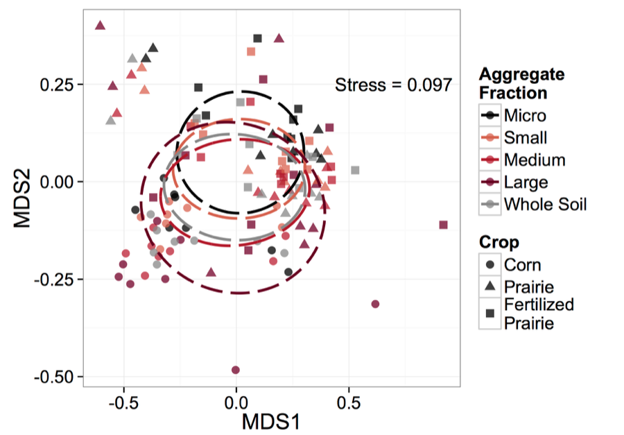
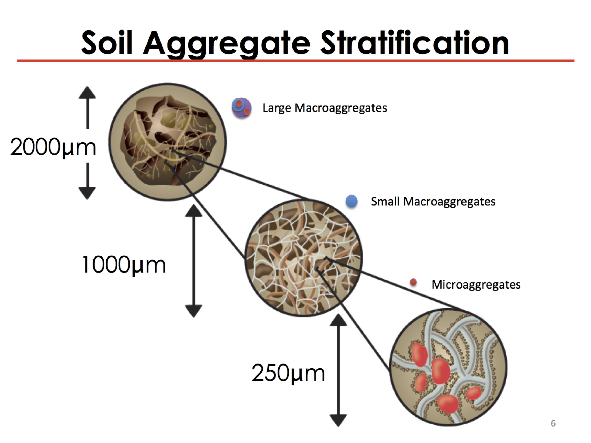

------
#COBS: A Background

The Comparison of Biofuels Systems (COBS) is a field trial and collaboration between Iowa State University and the University of Illinois. The COBS experiment seeks to compare the impacts of different biofuel production systems. Of particular interest is the impact of the prodcution system on carbon cycling and soil health. In order to investigate this impact, a unique soil sampling was performed in 2012, so that metagenomes could be assembled and used to explore the distribution of carbon cycling genes. 

What made this soil sampling unique was the seperation of the soil into aggregate fraction, in a non-destructive maner. In short, the soil was sieved at 4 degrees c. using sieves that coorospoind to the aggregate fraction of interest. 

Previous investigations into this data set have shown that there is a distribution/differences in bacterial communities accross aggregate fractions and croping systems. 




What is an aggregate?
  Soil aggregates are groups of soil particles that bind to each other more strongly than to adjacent particles. The space between the aggregates   provide pore space for retention and exchange of air and water.

What is a metagenome? 
  A library constructed from the DNA extracted from all organisms in the soil. 
  
So we have a unique dataset that consists of all the DNA from soil aggregate fractions from the COBS experiment. In addition to the genomic data, we started with metadata that was not tidy.

Our challenge was to use the metagenome libraries to construct abundance tables that quantify the abundance of bacterial species capable of performing a step in the decompostion of celluslose. In order to facilitate our analysis of these data in R, we had to tidy up the COBS metadata. The metadata consists of many chemical and physical characteristics of the soil samples from the cobs aggregate fractions. 

For investigating the presence of ceullityic bacteria, we needed to generate a list of bacterial sequences associated with cellulose degredation. We did this by searching the NCBI database for amino acid sequences associated with 1 of 3 enzymes. The enzymes we are interested are all involved in the break down of cellulose in the soil. Once we have this list, we can compare the aggregate fractions for the abundance of cellulytic bacteria. 

We can do this by quantifying the amount of bacteria that have genes associated with carbon degrading enzymes of intrest. These enzymes are: 

  1. (BG) beta-glucosidase [EC:3.2.1.21] is an Endocellulase
  2. (BX) beta-D-xylosidase 4 [EC:3.2.1.37] is an Exocellulase
  3. (CB) 1,4-beta-cellobiosidase [EC:3.2.1.91] is a Cellobiase
  
Together these thre enzymes can convert a cellulose crystal to glucose molecules.  


###Stuff below this line should be put into the appendix, not a part of the actual presentation
First, let's confirm that we have the required tools for asking questions of the NCBI database. To do this we will use the NCBI API: Entrez Direct and install it via the UNIX command line. 
```{bash, eval=FALSE}
pwd
cd ~
perl -MNet::FTP -e \
  '$ftp = new Net::FTP("ftp.ncbi.nlm.nih.gov", Passive => 1);
   $ftp->login; $ftp->binary;
   $ftp->get("/entrez/entrezdirect/edirect.zip");'
unzip -u -q edirect.zip
rm edirect.zip
export PATH=$PATH:$HOME/edirect
./edirect/setup.sh
```
Let's take a look to confirm that it was installed in the home directory:
```{bash}
cd ~
ls
```
Now that we have the tools, what will we use them for? COBS is a unique dataset that includes many metagenomes from soil aggregates. Many functions in ecosystems are microbially mediated and catalyzed by enzymes. In this study, funded by the DOE, we are interested in carnon cycleing and therefore the enyzmes associated with that funciton. Our collaborator (Kirsten Hofmockel) has identified a few enzymes of interest for our system. The list of enzymes is contained in a text file: ec_numbers.txt
Let's navigate to that directory and take a look:
```{bash}
cd ~/Documents/COBS_CAZY
cat ec_numbers.txt
```
We now have a list of enzymes of interest, let's use those NCBI tools to find bacterial sequences associated with those enzymes by creating a python script:  
```{python, eval=FALSE}
import sys
from Bio import Entrez, SeqIO

Entrez.email = 'jflater@iastate.edu'

# First, find entries that contain the E.C. number
ec_num = sys.argv[1].strip()
#print ec_num
#print 'E.C. '+ ec_num
esearch_handle = Entrez.esearch(db='nucleotide', term='EC '+ec_num)
# When term='E.C. we get zero results, however, if term=EC it works
entries = Entrez.read(esearch_handle)
esearch_handle.close()

# Second, fetch these entries
efetch_handle = Entrez.efetch(db='nucleotide', id=entries['IdList'], rettype='gb', retmode='xml') 
records = Entrez.parse(efetch_handle)

# Now, we go through the records and look for a feature with name 'EC_number'
for record in records:
      for feature in record['GBSeq_feature-table']:
          for subfeature in feature['GBFeature_quals']:
              if (subfeature['GBQualifier_name'] == 'EC_number'   and
                subfeature['GBQualifier_value'] == ec_num):

                    # If we found it, we extract the seq's start and end
                    accession = record['GBSeq_primary-accession']
                    interval = feature['GBFeature_intervals'][0]
                    interval_start = interval['GBInterval_from']
                    interval_end = interval['GBInterval_to']
                    location = feature['GBFeature_location']
                    if location.startswith('complement'):
                        strand = 2
                    else:
                        strand = 1

                    # Now we fetch the nucleotide sequence
                    handle = Entrez.efetch(db="nucleotide", id=accession,
                                           rettype="fasta", strand=strand,
                                           seq_start = interval_start,
                                           seq_stop = interval_end)
                    seq = SeqIO.read(handle, "fasta")

                    print('>GenBank Accession:{}'.format(accession))
                    print(seq.seq)
efetch_handle.close()

```
Now let's apply that script to our list of EC #'s by using the command line:
```{bash, eval=FALSE}
while read line;     
  do python scripts/nucl_from_ec.py $line > "$line".txt;    
  done < ec_numbers.txt
```

```{bash}
cd Documents/COBS_CAZY
less 3.2.1.37.txt 
```

To use hpcc:
Lot's of disc space, temporary unlimited (3 months)
```{bash}
ssh *****@hpcc.msu.edu
password:
#We are now at the gateway, we must connect to a development node
ssh dv-intel16
#Now we move to a scratch folder
cd /mnt/scratch/*****
```

Now that we are in a space where we can download data and perform work, let's download the NCBI db
```{bash}
#Make a directory for this project
mkdir COBS_CAZY
cd COBS_CAZY/
#now we create a program to downlaod the db
emacs download.refseq.qsub
```

now lets download db to that  ftp://ftp.ncbi.nlm.nih.gov
refseq_protien.10.tar.gz.md5 and *.gz is what we want to put on HPCC
```{bash}
pwd
cd Documents/COBS_CAZY/scripts
cat download.refseq.qsub
```

In HPC: move out of dev intel...everyone is using it. There are many more computers to choose from begind that...called nodes
We want to work in a node, we need to submit a job by using qsub
```{bash, eval=FALSE}

```

[*****@dev-intel16 ~]$ cd /mnt/scratch/*****
[*****@dev-intel16 *****]$ ls
[*****@dev-intel16 *****]$ mkdir COBS_CAZY
[*****@dev-intel16 *****]$ cd COBS_CAZY/
[*****@dev-intel16 COBS_CAZY]$ emacs download.refseq.qsub

[1]+  Stopped                 emacs download.refseq.qsub
[*****@dev-intel16 COBS_CAZY]$ ls
download.refseq.qsub  download.refseq.qsub~
[*****@dev-intel16 COBS_CAZY]$ rm *~
[*****@dev-intel16 COBS_CAZY]$ ls
download.refseq.qsub
[*****@dev-intel16 COBS_CAZY]$ qsub download.refseq.qsub
37523906.mgr-04.i
[*****@dev-intel16 COBS_CAZY]$ ls
download.refseq.qsub
[*****@dev-intel16 COBS_CAZY]$

.o is output, .e is error

S = Q in line
S = R running
S = C complete

Check if everything downloaded correctly by using md5(it tells us if downloaded correctly)
Once all is downlaoded, unzip


Then ready to run blastp (files in fasta) clone the github repository
# note change spellin on protein for emacs

module load git (to upload repository)
git clone url
once repository is uploaded then blastp

submit blastp: qsub blastp.qsub

#2016_12_02:09:06 AM, Noticed that we did not qsub blastp for EC *.86, let's make that script and submit the job. 
```{bash, eval=FALSE}
ssh *****@hpcc.msu.edu
password:
ssh dev-intel16
cd /mnt/scratch/*****/COBS_CAZY
ls

```

